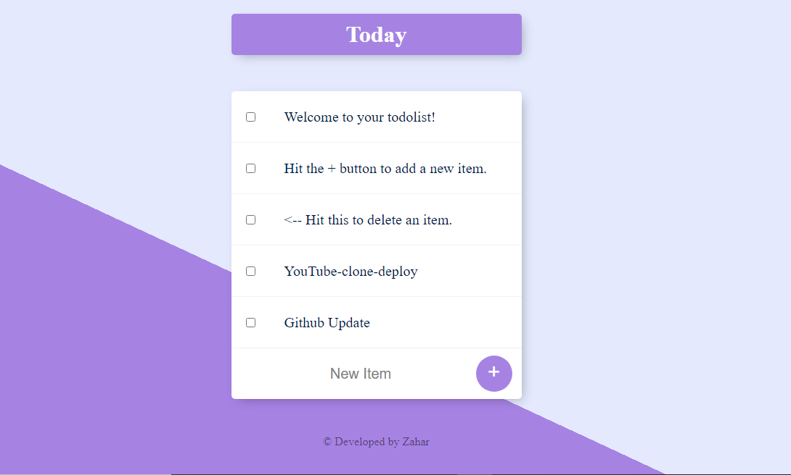

# todoList-Node

<h3>Visit the Site</h3> https://zahar-todolist.herokuapp.com/  

<h3>Information </h3> todolist app NodeJS + MongoDB

<h3>Features </h3> Hit the + button to add a new item.
<-- Hit this to delete an item.

<h3>Tech Stack </h3>  1) NodeJS  2) Express 3) MongoDB 4) Mongoose

  

